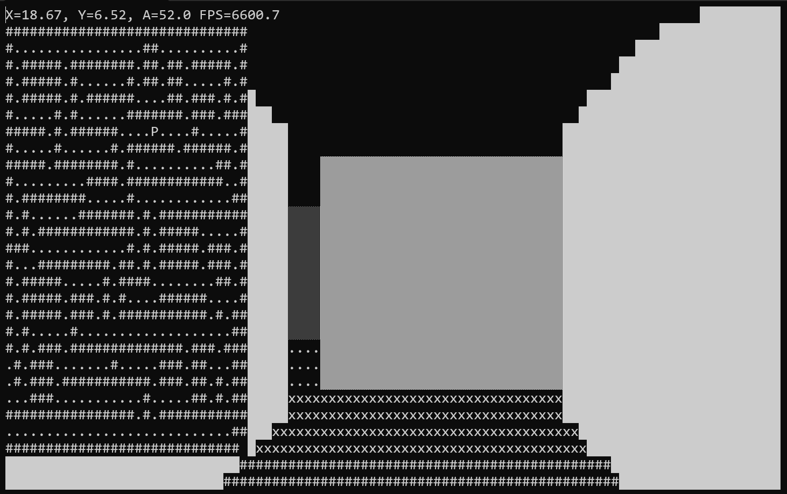
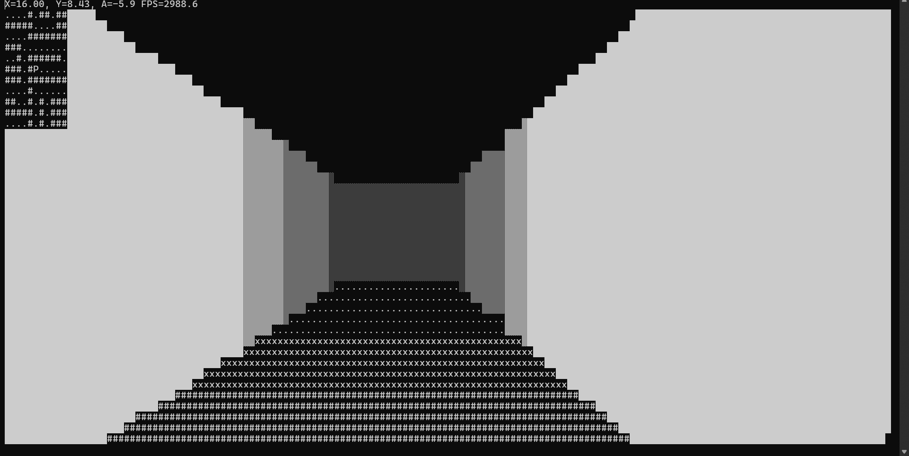

# Maze
This game uses ray tracing to map a maze to the Windows Powershell console in first-person view with a coordinate system.
There is a map on the top-left hand side that scrolls as the player moves. This may be configured to a full-size static map.

Navigate through the maze using: 
- **A/D** to rotate the field of view left/right 
- **W/S** to move forward/backward.


## Installation
> 1. Clone the repository into Microsoft Visual Studio 2022:
```bash 
git clone https://github.com/arowe54/Maze_Console_Game.git
```
> 2. Press Run using the Visual Studio GUI to Run the Program


## Setup
Use Windows PowerShell for the Console.

- right-click the console, go to __"Settings" > "Startup" > "Launch Size"__ and make the size 156 columns (for a Dell Laptop) and 41 rows.

- Then, go to __"Settings" > "Defaults" (or Windows Powershell) > "Appearance"__ and use "Consolas" font with size 16.

Note: This project uses Microsoft Visual Studio 2022 based on a C++ Console Application Project.

## Screenshots

Figure 1: Screenshot of the Console with the Player (P) near the Top of a Static Map



Figure 2: Screenshot of the Console with a Narrow path and a Scrolling Map


## Credit
Functional code and HUD based on this Youtube Video from javidx9 : https//www.youtube.com/watch?v=xW8skO7MFYw&list=WL&index=14&t=4s 

Copyright 2018-2022 OneLoneCoder.com
